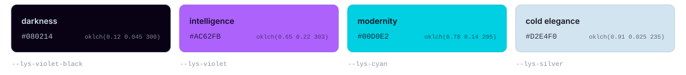

<div align="center">

<picture>
  <source media="(prefers-color-scheme: dark)" srcset=".github/assets/hero-dark.svg">
  <source media="(prefers-color-scheme: light)" srcset=".github/assets/hero-light.svg">
  
</picture>

<p>
  
  
  
  
  <a href="https://lys.negentropy.studio"></a>
</p>

<p>
  <a href="https://lys.negentropy.studio"><b>Handbook</b></a> &nbsp;·&nbsp;
  <a href="#quick-start"><b>Quick start</b></a> &nbsp;·&nbsp;
  <a href="https://lys.negentropy.studio/architecture/system/"><b>Architecture</b></a> &nbsp;·&nbsp;
  <a href="CONTRIBUTING.md"><b>Contributing</b></a>
</p>

</div>


<div align="center">

**Lys is a local-first desktop chat application.**

Your models run on your machine. Your conversations never leave it.<br>
No account, no cloud fallback, no remote surface to expose.

</div>

|                          |                                                                                |
| ------------------------ | ------------------------------------------------------------------------------ |
| **Local-first**          | LM Studio on `127.0.0.1:1234`, SQLite in `~/.lys`. Nothing leaves the machine. |
| **Loopback only**        | The backend binds `127.0.0.1:12345`.                                           |
| **Typed end to end**     | Routes and every stream event are Zod schemas in `@lys/protocol`.              |
| **Streaming by default** | One request, one `text/event-stream`, applied as it arrives.                   |

> [!IMPORTANT]
> Alpha, under active development. A chat turn streams end to end today, but conversation history is not yet restored after relaunch — see [implementation status](https://lys.negentropy.studio/overview/status/).


## How it works

<picture>
  <source media="(prefers-color-scheme: dark)" srcset=".github/assets/turn-dark.svg">
  <source media="(prefers-color-scheme: light)" srcset=".github/assets/turn-light.svg">
  
</picture>

<div align="center">
  <sub>One chat turn, end to end · <a href="https://lys.negentropy.studio/architecture/system/">System overview</a> · <a href="https://lys.negentropy.studio/reference/sse-events/">SSE events</a></sub>
</div>


## Quick start

Node 24 · pnpm 11 · Rust · [LM Studio](https://lmstudio.ai) running on `127.0.0.1:1234`

```sh
pnpm install
pnpm dev          # desktop app
pnpm backend:dev  # backend, unless the desktop starts it for you
```

[Environment setup →](https://lys.negentropy.studio/develop/setup/)


## Identity



<div align="center">
  <sub>Authored in OKLCH. Owned by <code>apps/desktop/src/index.css</code>.</sub>
</div>


## Contributing

Read [CONTRIBUTING.md](CONTRIBUTING.md) first. Construction rules, the JSDoc standard, and review procedure live in [`docs/`](docs/) — they are merge requirements, not recommendations.

Licensed under the [Mozilla Public License 2.0](LICENSE).


<div align="center">
  <sub><b>Lysiptera Caliginia</b> · built by <a href="https://github.com/w3lt">Welt</a> at <a href="https://negentropy.studio">Negentropy Studio</a></sub>
</div>
